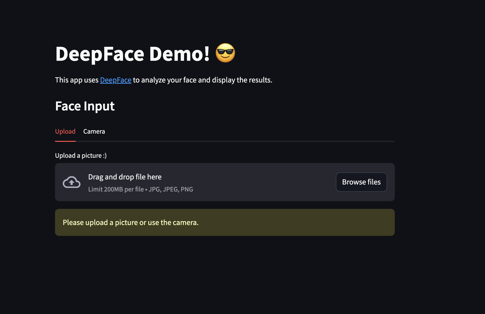

DeepFace Streamlit
========================

This app uses [DeepFace](https://github.com/serengil/deepface) to analyze your face and display the results in a Streamlit app.



## How to run

1. Clone the repository
```bash
git clone https://github.com/simonsanvil/deepface-streamlit
```

2. Navigate to the cloned directory
```bash
cd deepface-streamlit
```

3. Install the required packages
```bash
pip install uv
uv sync
```

4. Run the Streamlit app
```bash
uv run streamlit run app.py
```

5. Open your browser and go to `http://localhost:8501` to view the app.


